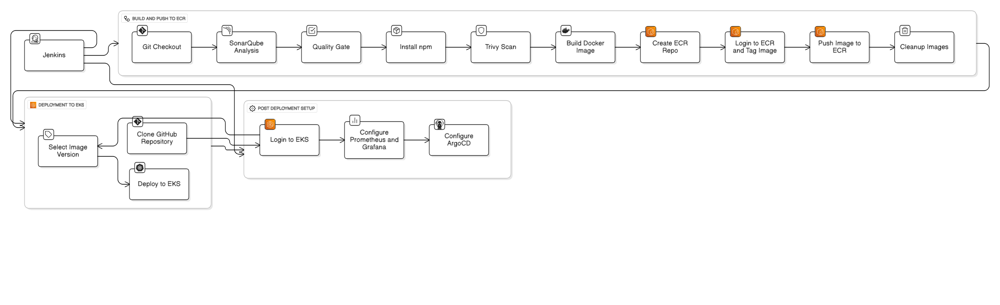
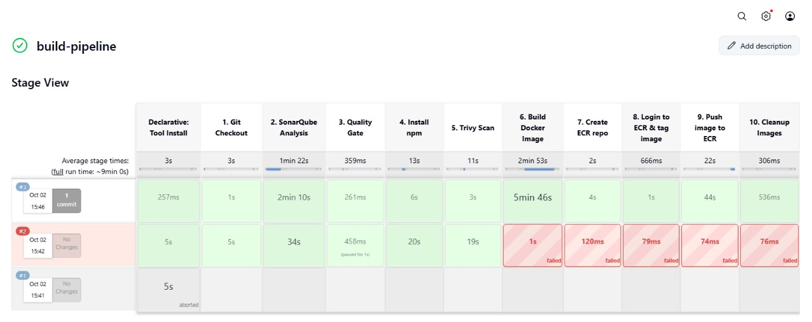
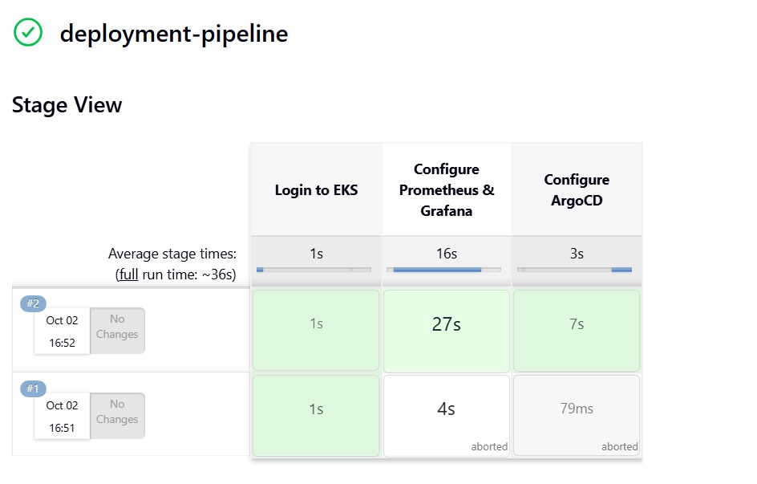
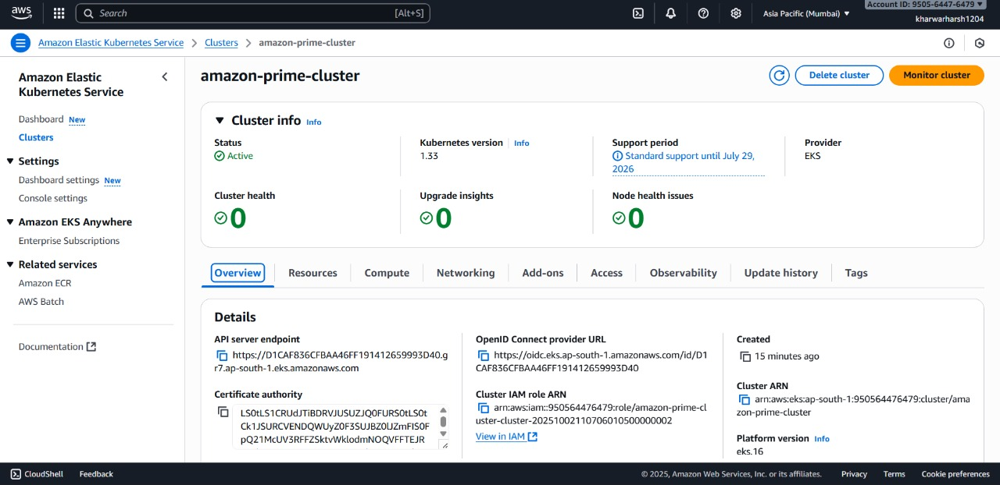
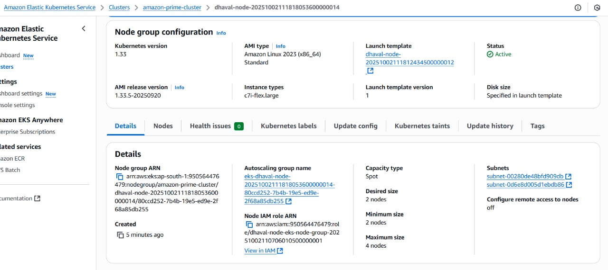
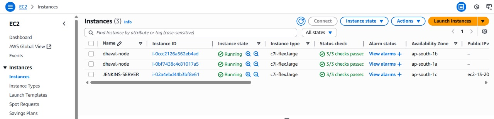
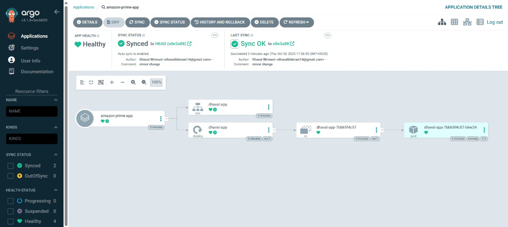
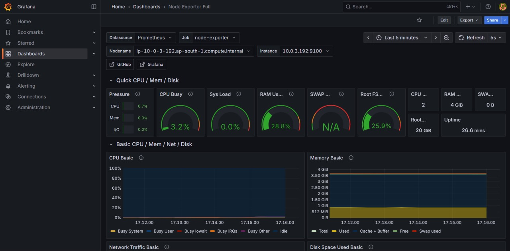

# Amazon Prime Clone Deployment Project

## Project Overview

This project demonstrates deploying an Amazon Prime Clone application using modern DevOps practices and tools. It covers CI/CD automation, code quality checks, containerization, deployment to Kubernetes, and monitoring.

- **Terraform**: Infrastructure as Code (IaC) tool to create AWS infrastructure such as EC2 instances and EKS clusters.
- **GitHub**: Source code management.
- **Jenkins**: CI/CD automation tool.
- **SonarQube**: Code quality analysis and quality gate tool.
- **NPM**: Build tool for NodeJS.
- **Aqua Trivy**: Security vulnerability scanner.
- **Docker**: Containerization tool to create images.
- **AWS ECR**: Repository to store Docker images.
- **AWS EKS**: Container management platform.
- **ArgoCD**: Continuous deployment tool.
- **Prometheus & Grafana**: Monitoring and alerting tools.

## Pre-requisites

* AWS Account with IAM user and programmatic access.
* AWS CLI installed and configured.
* Terraform installed.
* Git installed.

## Infrastructure Setup (Terraform)

* Provision EC2 instance for Jenkins, SonarQube, and supporting tools.
* Provision EKS cluster for container orchestration.
* Create required networking and security groups.

## Jenkins Configuration

* Install required plugins (SonarQube, NodeJS, Docker, Prometheus metrics, etc.).
* Configure global tools (JDK 17, Sonar Scanner, NodeJS, Docker).
* Add credentials for SonarQube, AWS Access/Secret Keys.

## Pipeline Overview

### Build Pipeline

- **Git Checkout** → Fetch code from GitHub.
- **SonarQube Analysis** → Static code analysis.
- **Quality Gate** → Enforce code quality.
- **Install Dependencies** → Install NodeJS packages.
- **Trivy Scan** → Security scan.
- **Docker Build** → Build image.
- **Push to AWS ECR** → Tag & push image.
- **Cleanup** → Remove unused Docker images.

### Deployment Pipeline

- **EKS Login** → Authenticate and configure kubeconfig.
- **Prometheus & Grafana Setup** → Monitoring stack installation.
- **ArgoCD Setup** → GitOps deployment tool installation.
- **Application Deployment** → Deploy Amazon Prime Clone from ECR to AKS.

### Cleanup Pipeline

- Delete Kubernetes services, deployments, ArgoCD, Prometheus stack, and namespaces.
- Delete ECR repository and KMS keys.
- Destroy infrastructure with Terraform.

## Diagrams

### 1. Build Pipeline

### 2. Deployment Pipeline

### 3. Kubernetes Cluster (AWS EKS/AKS)

### 4. Node Group

### 5. Nodes in EC2

### 6. ArgoCD

### 7. Grafana Dashboard

## Outcome

This setup delivers:

* Automated CI/CD pipeline.
* Enforced code quality and security scanning.
* Scalable deployments to Kubernetes (EKS).
* GitOps-driven deployments with ArgoCD.
* Real-time monitoring with Prometheus and Grafana.